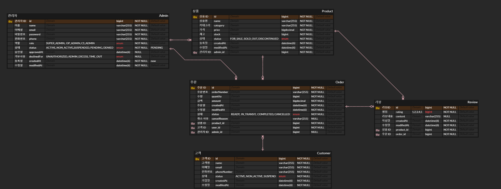

# E-Commerce Backoffice System

이커머스 백오피스 관리 시스템 - 관리자, 고객, 상품, 주문, 리뷰를 통합 관리하는 REST API 기반 백엔드 애플리케이션

## 📋 목차

- [프로젝트 개요](#-프로젝트-개요)
- [주요 기능](#-주요-기능)
- [기술 스택](#-기술-스택)
- [시스템 아키텍처](#-시스템-아키텍처)
- [ERD](#-erd)
- [API 명세](#-api-명세)
- [설치 및 실행](#-설치-및-실행)
- [보안](#-보안)
- [프로젝트 구조](#-프로젝트-구조)

---

## 🎯 프로젝트 개요

이커머스 플랫폼의 백오피스 시스템으로, 관리자가 고객, 상품, 주문, 리뷰를 효율적으로 관리할 수 있는 RESTful API 서버입니다.

### 핵심 특징

- **역할 기반 접근 제어 (RBAC)**: 3단계 관리자 권한 체계 (SUPER_ADMIN, OP_ADMIN, CS_ADMIN)
- **JWT 기반 무상태 인증**: Stateless 아키텍처로 수평 확장 가능
- **실시간 대시보드**: 매출, 주문 현황, 재고 상태 등 핵심 지표 모니터링
- **자동화된 재고 관리**: 주문 생성/취소 시 재고 자동 차감/복구
- **상태 기반 워크플로우**: 주문/상품/관리자 상태 자동 전이 로직

---

## 🚀 주요 기능

### 1. 관리자 관리 (Admin)

- **승인 기반 관리자 가입**: PENDING → ACTIVE/DENIED 워크플로우
- **3단계 권한 체계**:
  - `SUPER_ADMIN`: 전체 시스템 관리 (관리자 승인/거부, 고객 삭제)
  - `OP_ADMIN`: 운영 관리 (상품 등록, 대시보드 접근)
  - `CS_ADMIN`: 고객 지원 (기본 조회 권한)
- **상태 관리**: ACTIVE, NON_ACTIVE, SUSPENDED, PENDING, DENIED
- **기능**:
  - 관리자 가입 신청 및 승인/거부
  - 프로필 조회/수정, 비밀번호 변경
  - 관리자 목록 조회 (검색, 필터링, 페이징)
  - 관리자 상태 변경 (활성화, 비활성화, 정지)
  - 역할 변경 및 삭제

### 2. 고객 관리 (User)

- **상태 관리**: ACTIVE, NON_ACTIVE, SUSPEND
- **고객별 통계**: 총 주문 수, 총 구매 금액 (취소 주문 제외)
- **기능**:
  - 고객 목록 조회 (이름/이메일 검색, 상태 필터링)
  - 고객 상세 정보 및 주문 통계 조회
  - 고객 정보 수정, 상태 변경
  - 고객 삭제 (SUPER_ADMIN 전용)

### 3. 상품 관리 (Product)

- **자동 상태 관리**:
  - 재고 0 이하 → `SOLD_OUT` 자동 전환
  - 재고 추가 시 → `FOR_SALE` 자동 복구
  - `DISCONTINUED` (단종) 상태는 수동 설정 유지
- **저재고 감지**: 재고 6개 미만 상품 자동 추적
- **기능**:
  - 상품 등록 (SUPER_ADMIN, OP_ADMIN)
  - 상품 목록 조회 (키워드, 카테고리, 상태 필터링)
  - 상품 상세 조회 (리뷰 통계 포함)
  - 정보 수정 (이름, 카테고리, 가격)
  - 재고 수정 (자동 상태 업데이트)
  - 상태 수동 변경, 삭제

### 4. 주문 관리 (Order)

- **주문 상태 전이**: READY → IN_TRANSIT → COMPLETED
- **재고 연동**:
  - 주문 생성 시 재고 자동 차감
  - 주문 취소 시 재고 자동 복구
- **주문 검증 로직**:
  - 단종 상품 주문 차단
  - 품절 상품 주문 차단
  - 재고 부족 체크
- **기능**:
  - 주문 생성 (주문번호 자동 생성: `날짜-UUID`)
  - 주문 목록 조회 (주문번호/고객명 검색, 상태 필터)
  - 주문 상세 조회
  - 주문 상태 변경 (다음 단계로 전이)
  - 주문 취소 (READY 상태만 가능, 사유 필수)

### 5. 리뷰 관리 (Review)

- **리뷰 통계**: 평균 평점, 별점 분포 (1~5점)
- **상품별 리뷰 표시**: 최신 리뷰 3개 자동 조회
- **기능**:
  - 리뷰 목록 조회 (상품명/고객명 검색, 평점 필터)
  - 리뷰 상세 조회
  - 리뷰 삭제 (SUPER_ADMIN, OP_ADMIN)

### 6. 대시보드 (Dashboard)

SUPER_ADMIN, OP_ADMIN 전용 실시간 통계 API

#### Summary Stats
- 총 관리자/활성 관리자
- 총 고객/활성 고객
- 총 상품/저재고 상품
- 총 주문/오늘 주문
- 총 리뷰/평균 평점

#### Widgets Stats
- 총 매출/오늘 매출
- 주문 상태별 카운트 (준비중, 배송중, 완료)
- 저재고 상품/품절 상품

#### Charts Stats
- 리뷰 평점 분포
- 고객 상태 분포
- 카테고리별 상품 분포

#### Late Order List
- 최근 주문 10건 리스트

---

## 🛠 기술 스택

### Backend
- **Java 17**: LTS 버전, Record/Pattern Matching 등 최신 기능 활용
- **Spring Boot 4.0.1**: 최신 Spring Framework 기반 빠른 개발
- **Spring Data JPA**: ORM 기반 데이터 접근 계층 추상화
- **Hibernate**: JPA 구현체, 엔티티 관리 및 SQL 자동 생성

### Security
- **Spring Security**: 인증/인가 프레임워크
- **JWT (JSON Web Token)**: Stateless 인증 (JJWT 0.11.5)
- **BCrypt**: 비밀번호 암호화

### Database
- **MySQL 8.x**: RDBMS
- **JPA Auditing**: 생성일/수정일 자동 관리

### Validation & Data
- **Bean Validation (Hibernate Validator)**: DTO 입력 검증
- **Lombok**: 보일러플레이트 코드 자동 생성
- **BigDecimal**: 금액 정확성 보장

### Build & Test
- **Gradle**: 빌드 자동화 도구

---

## 🏗 시스템 아키텍처

### 계층형 아키텍처 (Layered Architecture)

```
┌─────────────────────────────────────┐
│       Presentation Layer            │
│    (Controller, DTO, Validation)    │
├─────────────────────────────────────┤
│         Business Layer              │
│          (Service Logic)            │
├─────────────────────────────────────┤
│      Persistence Layer              │
│   (Repository, Entity, JPA)         │
├─────────────────────────────────────┤
│         Database Layer              │
│            (MySQL)                  │
└─────────────────────────────────────┘
```

### 주요 설계 패턴

1. **도메인 주도 설계 (DDD)**
   - 도메인별 패키지 분리 (admin, user, product, order, review)
   - 각 도메인의 비즈니스 로직 캡슐화

2. **DTO 패턴**
   - Request/Response DTO로 계층 간 데이터 전달
   - 엔티티 직접 노출 방지

3. **Repository 패턴**
   - Spring Data JPA를 통한 데이터 접근 추상화
   - Custom Query (JPQL) 활용

4. **Exception Hierarchy**
   - 도메인별 커스텀 예외 클래스
   - GlobalExceptionHandler로 통합 예외 처리

---

## 📊 ERD

```

```

---

## 📡 API 명세

### Authentication

| Method | Endpoint | Description | Auth Required |
|--------|----------|-------------|---------------|
| POST | `/admin/signup` | 관리자 가입 신청 | ❌ |
| POST | `/admin/login` | 로그인 (JWT 발급) | ❌ |
| POST | `/admin/logout` | 로그아웃 | ✅ |

### Admin Management

| Method | Endpoint | Description | Role |
|--------|----------|-------------|------|
| GET | `/admin/profile` | 내 프로필 조회 | ALL |
| PUT | `/admin/profile/general` | 내 정보 수정 | ALL |
| PUT | `/admin/profile/password` | 비밀번호 변경 | ALL |
| GET | `/admin/administrators` | 관리자 목록 조회 | SUPER_ADMIN |
| GET | `/admin/administrators/{id}` | 관리자 상세 조회 | SUPER_ADMIN |
| PUT | `/admin/administrators/{id}` | 관리자 정보 수정 | SUPER_ADMIN |
| PUT | `/admin/administrators/{id}/activation` | 관리자 승인 | SUPER_ADMIN |
| PUT | `/admin/administrators/{id}/denial` | 관리자 거부 | SUPER_ADMIN |
| PUT | `/admin/administrators/{id}/suspension` | 관리자 정지 | SUPER_ADMIN |
| PUT | `/admin/administrators/{id}/deactivation` | 관리자 비활성화 | SUPER_ADMIN |
| PUT | `/admin/administrators/role/{id}` | 관리자 역할 변경 | SUPER_ADMIN |
| DELETE | `/admin/administrators/{id}/deletion` | 관리자 삭제 | SUPER_ADMIN |

### User Management

| Method | Endpoint | Description | Role |
|--------|----------|-------------|------|
| GET | `/admin/users` | 고객 목록 조회 | ALL |
| GET | `/admin/users/{id}` | 고객 상세 조회 | ALL |
| PUT | `/admin/users/{id}` | 고객 정보 수정 | ALL |
| PUT | `/admin/users/status/{id}` | 고객 상태 변경 | ALL |
| DELETE | `/admin/users/{id}` | 고객 삭제 | SUPER_ADMIN |

### Product Management

| Method | Endpoint | Description | Role |
|--------|----------|-------------|------|
| POST | `/admin/products` | 상품 등록 | SUPER_ADMIN, OP_ADMIN |
| GET | `/admin/products` | 상품 목록 조회 | ALL |
| GET | `/admin/products/{id}` | 상품 상세 조회 | ALL |
| PUT | `/admin/products/{id}` | 상품 정보 수정 | ALL |
| PUT | `/admin/products/stock/{id}` | 재고 수정 | ALL |
| PUT | `/admin/products/status/{id}` | 상태 수정 | ALL |
| DELETE | `/admin/products/{id}` | 상품 삭제 | ALL |

### Order Management

| Method | Endpoint | Description | Role |
|--------|----------|-------------|------|
| POST | `/admin/orders` | 주문 생성 | ALL |
| GET | `/admin/orders` | 주문 목록 조회 | ALL |
| GET | `/admin/orders/{id}` | 주문 상세 조회 | ALL |
| PUT | `/admin/orders/{id}` | 주문 상태 변경 | ALL |
| PUT | `/admin/orders/{id}/cancelled` | 주문 취소 | ALL |

### Review Management

| Method | Endpoint | Description | Role |
|--------|----------|-------------|------|
| GET | `/admin/reviews` | 리뷰 목록 조회 | ALL |
| GET | `/admin/reviews/{id}` | 리뷰 상세 조회 | ALL |
| DELETE | `/admin/reviews/{id}` | 리뷰 삭제 | SUPER_ADMIN, OP_ADMIN |

### Dashboard

| Method | Endpoint | Description | Role |
|--------|----------|-------------|------|
| GET | `/admin/dashboards/summary` | 요약 통계 | SUPER_ADMIN, OP_ADMIN |
| GET | `/admin/dashboards/widgets` | 위젯 통계 | SUPER_ADMIN, OP_ADMIN |
| GET | `/admin/dashboards/charts` | 차트 통계 | SUPER_ADMIN, OP_ADMIN |
| GET | `/admin/dashboards/lateorderlist` | 최근 주문 목록 | SUPER_ADMIN, OP_ADMIN |

---

## 🔧 설치 및 실행

### 사전 요구사항

- Java 17 이상
- MySQL 8.0 이상
- Gradle 7.x 이상

### 1. 저장소 클론

```bash
git clone https://github.com/your-username/backoffice.git
cd backoffice
```

### 2. 데이터베이스 설정

MySQL에 데이터베이스 생성:

```sql
CREATE DATABASE backoffice;
```

### 3. 빌드 및 실행

```bash
# Gradle 빌드
./gradlew build

# 애플리케이션 실행
./gradlew bootRun
```

서버는 기본적으로 `http://localhost:8080`에서 실행됩니다.

### 4. 초기 데이터 확인

애플리케이션 시작 시 `SuperAdminDataInitializer`가 자동 실행되어 테스트 데이터가 생성됩니다:

**슈퍼 관리자 계정**:
- 이메일: `super@naver.com`
- 비밀번호: `12345678`
- 역할: `SUPER_ADMIN`

---

## 🔒 보안

### 인증/인가 플로우

```
1. 로그인 요청
   POST /admin/login
   { "email": "super@naver.com", "password": "12345678" }

2. JWT 발급
   Response: { "token": "eyJhbGciOiJIUzI1NiIsInR5cCI6IkpXVCJ9..." }

3. 이후 요청 시 헤더에 토큰 포함
   Authorization: Bearer {token}

4. JwtAuthenticationFilter에서 토큰 검증
   - 토큰 서명 검증
   - 만료 시간 확인
   - SecurityContext에 인증 정보 저장

5. @PreAuthorize로 권한 검증
   - hasRole('SUPER_ADMIN')
   - hasAnyRole('SUPER_ADMIN', 'OP_ADMIN')
```

### 보안 기능

- **비밀번호 암호화**: BCrypt 해싱 (단방향 암호화)
- **JWT 토큰**: HS256 알고리즘, 24시간 유효
- **CSRF 보호**: 비활성화 (Stateless API)
- **세션 관리**: STATELESS (서버에 세션 저장 안 함)
- **권한별 엔드포인트 제어**: Method Security (`@PreAuthorize`)

### 예외 처리

- **인증 실패**: 401 Unauthorized
- **권한 부족**: 403 Forbidden
- **토큰 만료**: 401 Unauthorized (TOKEN_EXPIRED)
- **잘못된 토큰**: 401 Unauthorized (TOKEN_INVALID)

---

## 📁 프로젝트 구조

```
src/main/java/com/example/backoffice/
├── admin/                          # 관리자 도메인
│   ├── consts/                     # 상수 (AdminRole, AdminStatus)
│   ├── controller/                 # REST API 컨트롤러
│   ├── dto/                        # Request/Response DTO
│   ├── entity/                     # JPA 엔티티
│   ├── exception/                  # 커스텀 예외
│   ├── repository/                 # JPA Repository
│   └── service/                    # 비즈니스 로직
├── authentication/                 # 인증 도메인
│   ├── consts/                     # 인증 상태
│   ├── controller/                 # 로그인/로그아웃
│   ├── dto/                        # 로그인 DTO
│   ├── exception/                  # 인증 예외
│   └── service/                    # 인증 서비스
├── common/                         # 공통 모듈
│   ├── config/                     # 설정 클래스
│   │   ├── BaseEntity.java         # 생성일/수정일 추상 클래스
│   │   ├── GlobalExceptionHandler  # 전역 예외 처리
│   │   └── SecurityConfig.java     # Spring Security 설정
│   ├── dto/                        # 공통 응답 DTO
│   │   ├── SuccessResponse         # 성공 응답 형식
│   │   └── ErrorResponse           # 에러 응답 형식
│   ├── exception/                  # 공통 예외
│   └── responsecode/               # 응답 코드/메시지
├── dashboard/                      # 대시보드 도메인
│   ├── controller/
│   ├── dto/
│   └── service/
├── jwt/                            # JWT 모듈
│   ├── AdminDetails.java           # UserDetails 구현체
│   ├── AdminDetailService.java     # UserDetailsService 구현
│   ├── JwtAuthenticationFilter     # JWT 인증 필터
│   ├── JwtUtil.java                # JWT 생성/검증 유틸
│   └── JwtAccessDeniedHandler      # 권한 거부 핸들러
├── order/                          # 주문 도메인
│   ├── consts/
│   ├── controller/
│   ├── dto/
│   ├── entity/
│   ├── exception/
│   ├── repository/
│   └── service/
├── product/                        # 상품 도메인
│   ├── consts/
│   ├── controller/
│   ├── dto/
│   ├── entity/
│   ├── exception/
│   ├── repository/
│   └── service/
├── review/                         # 리뷰 도메인
│   ├── controller/
│   ├── dto/
│   ├── entity/
│   ├── exception/
│   ├── repository/
│   └── service/
├── superadmin/                     # 초기화 모듈
│   └── SuperAdminDataInitializer   # 테스트 데이터 생성
└── user/                           # 고객 도메인
    ├── consts/
    ├── controller/
    ├── dto/
    ├── entity/
    ├── exception/
    ├── repository/
    └── service/
```

---

## 💡 주요 기술적 특징

### 1. Stateless JWT 인증

```java
// JWT 생성 시 사용자 정보와 권한을 토큰에 포함
String token = jwtUtil.generateToken(authentication);

// Claims: { id, email, role, iat, exp }
// 서버는 세션을 저장하지 않고 매 요청마다 토큰 검증만 수행
```

**장점**:
- 서버 메모리 부담 감소
- 수평 확장(Scale-out) 용이
- MSA 환경에 적합

### 2. 도메인 주도 예외 처리

각 도메인별 커스텀 예외를 계층화하여 명확한 에러 핸들링:

```java
AdminException
  ├── AdminNotFoundException
  ├── EmailDuplicationException
  └── InsufficientRoleException

OrderException
  ├── OrderNotFoundException
  ├── InsufficientStockException
  └── UnableCancelException
```

### 3. N+1 문제 해결

고객 목록 조회 시 주문 통계를 Map으로 변환하여 성능 최적화:

```java
// 1. 고객 목록 조회 (페이징)
Page<User> users = userRepository.findByNameKeyword(...);

// 2. 고객 ID 리스트 추출
List<Long> userIdList = users.map(User::getId).toList();

// 3. 한 번의 쿼리로 모든 고객의 주문 통계 조회
List<UserOrderDto> userOrders = orderRepository.findUserOrderDtoByUserIdList(userIdList);

// 4. Map으로 변환하여 O(1) 조회
Map<Long, UserOrderDto> orderDataByUser = userOrders.stream()
    .collect(Collectors.toMap(UserOrderDto::getUserID, dto -> dto));
```

### 4. 엔티티 내 비즈니스 로직 캡슐화

```java
// Product 엔티티
public void updateStock(Long stock) {
    this.stock = stock;
    
    if (status == ProductStatus.DISCONTINUED) {
        return;  // 단종 상품은 상태 유지
    }
    
    // 재고에 따른 자동 상태 전환
    this.status = (stock <= 0) ? ProductStatus.SOLD_OUT : ProductStatus.FOR_SALE;
}
```

### 5. JPQL을 활용한 복잡한 집계 쿼리

```java
// 리뷰 통계 (평균 평점 + 별점 분포)
@Query("SELECT NEW ProductReviewStatsDto(" +
       "r.product.id, count(r.id), avg(r.rating), " +
       "sum(case when r.rating = 1 then 1 else 0 end), " +
       "sum(case when r.rating = 2 then 1 else 0 end), " +
       "sum(case when r.rating = 3 then 1 else 0 end), " +
       "sum(case when r.rating = 4 then 1 else 0 end), " +
       "sum(case when r.rating = 5 then 1 else 0 end)) " +
       "FROM Review r WHERE r.product.id = :productId GROUP BY r.product.id")
ProductReviewStatsDto getProductReviewStats(Long productId);
```

---

## 📈 향후 개선 사항

- [ ] Refresh Token 도입 (Access Token + Refresh Token)
- [ ] Redis 캐싱 (대시보드 통계, 상품 조회)
- [ ] 비동기 처리 (이메일 알림, 대량 주문 처리)
- [ ] 페이징 성능 최적화 (No Offset 방식)
- [ ] 파일 업로드 (상품 이미지)
- [ ] 로그 관리 (SLF4J + Logback)
- [ ] API 문서화 (Swagger/OpenAPI)
- [ ] 통합 테스트 (TestContainers)
- [ ] CI/CD 파이프라인 (GitHub Actions)
- [ ] 모니터링 (Prometheus + Grafana)

---

## 📝 라이선스

이 프로젝트는 개인 포트폴리오 목적으로 작성되었습니다.

---

## 👤 작성자

**강동혁**

- Email: kangdh.no1@gmail.com
- GitHub: [@youzting](https://github.com/youzting)

**김세현**

- Email: kimsparadise0202@gmail.com
- GitHub: [@ginsengcandy](https://github.com/ginsengcandy)

**김재진**

- Email: truestory14@kakao.com
- GitHub: [@JJK3187](https://github.com/JJK3187)

**배주원**

- Email: bjw446@naver.com
- GitHub: [@bjw446](https://github.com/bjw446)

**함형우**

- Email: hyu@naver.com
- GitHub: [@hyuham1355-stack](https://github.com/hyuham1335-stack)